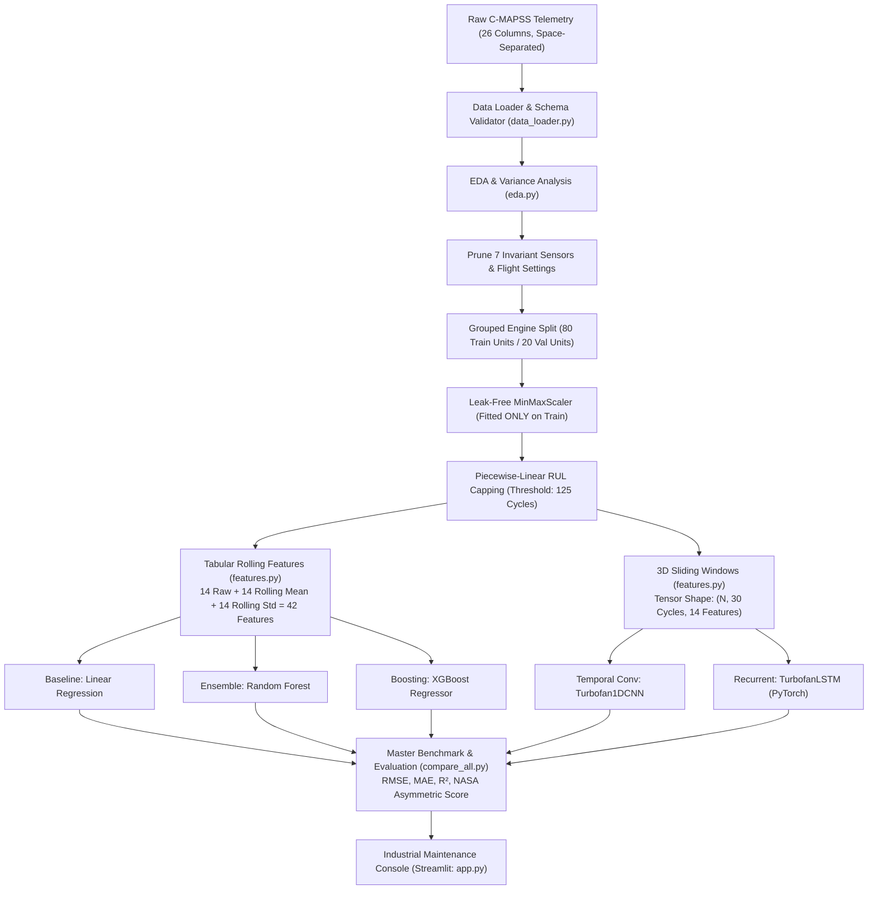

# Turbofan Engine Remaining Useful Life (RUL) Prediction

Predictive maintenance and Remaining Useful Life (RUL) estimation for turbofan machinery using the NASA C-MAPSS dataset. Features an end-to-end data pipeline with zero data leakage, a progression of models from Linear Regression to PyTorch LSTM, and an industrial-grade Streamlit maintenance console.

---

## System Architecture



---

## Empirical Benchmark Results (Official Test Set: 100 Engines)

All metrics were computed strictly from model execution against ground-truth labels from `RUL_FD001.txt`:

| Model Architecture | Model Family | Test RMSE | Test MAE | Test $R^2$ | NASA Score | Safe (Early) | Risk (Late) | Max Late Error | Max Early Error |
| :--- | :--- | :---: | :---: | :---: | :---: | :---: | :---: | :---: | :---: |
| **Linear Regression** | Baseline | 18.60 | 15.00 | 0.7997 | 591.1 | 43 | 57 | +43.0 cycles | -45.0 cycles |
| **Random Forest** | Tree Ensemble | 18.75 | 13.54 | 0.7964 | 755.9 | 41 | 59 | +49.9 cycles | -48.6 cycles |
| **XGBoost Regressor** | Tree Ensemble | 17.63 | 12.90 | 0.8200 | 637.4 | 45 | 55 | +47.2 cycles | -46.9 cycles |
| **Turbofan1DCNN** | Deep Learning | 21.33 | 16.26 | 0.7365 | 1706.3 | 38 | 62 | +61.5 cycles | -42.4 cycles |
| **TurbofanLSTM** | Deep Learning | **14.72** | **11.19** | **0.8745** | **361.4** | 45 | 55 | **+40.0 cycles** | **-35.1 cycles** |

---

## Key Highlights & Technical Decisions

1. **Zero Data Leakage**:
   - Split training data **by engine ID**, never by row. All 20 validation engines are completely unseen by training folds.
   - `MinMaxScaler` is fitted **exclusively on the 80 training engines**.
2. **Piecewise-Linear RUL Capping (125 Cycles)**:
   - Early operational cycles exhibit no detectable physical wear. Capping at 125 cycles prevents algorithms from overfitting to random sensor jitter during healthy life.
3. **NASA Asymmetric Scoring Function**:
   - In aerospace maintenance, a late prediction ($d_i \ge 0$) risks in-flight failure, whereas an early prediction ($d_i < 0$) causes minor downtime. The NASA score penalizes late errors exponentially harder ($e^{d/10}$ vs $e^{-d/13}$).
4. **PyTorch LSTM Superiority**:
   - Outperforms all models with a **16.5% lower RMSE** (14.72 vs 17.63 for XGBoost) and a **43.3% lower NASA penalty** (361.4 vs 637.4).
5. **Calm Industrial UI**:
   - Streamlit console designed with practical, information-first maintenance ergonomics (no marketing banners, no emojis, monospace telemetry numbers, multi-model consensus).

---

## Project Structure

```text
├── config/
│   └── config.py               # Single source of truth for paths, columns, hyperparameters
├── data/
│   ├── raw/                    # Original C-MAPSS text files (FD001–FD004)
│   └── processed/              # Normalized parquets and 3D sequence tensors
├── notebooks/
│   ├── 01_eda_and_sensor_analysis.ipynb
│   ├── 02_preprocessing_and_features.ipynb
│   ├── 03_classical_models.ipynb
│   ├── 04_deep_learning_models.ipynb
│   └── 05_comprehensive_evaluation.ipynb
├── src/
│   ├── data_loader.py          # Data ingestion and schema validation
│   ├── eda.py                  # Exploratory data analysis and variance profiling
│   ├── preprocess.py           # RUL calculation, capping, and MinMaxScaler
│   ├── features.py             # Rolling feature engineering and 3D window generation
│   ├── models.py               # Linear Regression, Random Forest, XGBoost, LSTM, 1D-CNN
│   ├── train.py                # Classical ML training and feature importance extraction
│   ├── train_deep.py           # PyTorch deep learning training and checkpointing
│   ├── evaluate.py             # RMSE, MAE, R², and NASA Asymmetric Scoring metrics
│   └── compare_all.py          # Master benchmark consolidation and diagnostic plots
├── models/                     # Saved weights (.joblib, .pt)
├── reports/
│   ├── figures/                # 11 diagnostic and evaluation plots
│   ├── master_benchmark_summary.csv
│   └── master_test_predictions.csv
├── app/
│   ├── app.py                  # Streamlit maintenance-engineer console
│   └── styles.css              # Industrial CSS styling
├── .streamlit/
│   └── config.toml             # Streamlit theme configuration
├── docs/
│   ├── DECISIONS.md            # Technical and UI/UX architectural decisions (for viva)
│   ├── DATASET.md              # Complete C-MAPSS dataset specification and physics
│   ├── RESULTS.md              # Detailed empirical benchmarks and error analysis
│   ├── VIVA_QA.md              # 25 viva questions and model answers
│   └── REPORT_OUTLINE.md       # Chapter-by-chapter college project report outline
├── requirements.txt            # Python dependencies
└── README.md                   # Project overview and run guide
```

---

## Quickstart & Execution Guide

### 1. Environment Setup
```bash
# Verify Python version (3.10+ required)
python3 --version

# Install dependencies
pip install -r requirements.txt
```

### 2. Run Data Preprocessing & Feature Engineering
```bash
# Computes RUL labels, applies 125 cap, fits scaler on train, exports 3D sequence tensors
python3 src/preprocess.py
python3 src/features.py
```

### 3. Train Classical Machine Learning Models
```bash
# Trains Linear Regression, Random Forest, and XGBoost; extracts feature importances
python3 src/train.py
```

### 4. Train Deep Learning Models (PyTorch)
```bash
# Trains PyTorch TurbofanLSTM and Turbofan1DCNN with validation early stopping
python3 src/train_deep.py
```

### 5. Generate Master Benchmark & Diagnostic Plots
```bash
# Compiles all 5 models and creates master comparison tables and figures
python3 src/compare_all.py
```

### 6. Launch the Streamlit Maintenance Console
```bash
streamlit run app/app.py
```
Open `http://localhost:8501` in your browser.

---

## Documentation Suite

Detailed viva defense notes and technical reports are available in the [`docs/`](docs/) directory:
- [**docs/DECISIONS.md**](docs/DECISIONS.md): Every architectural, preprocessing, hyperparameter, and UI/UX decision and WHY it was chosen over alternatives.
- [**docs/DATASET.md**](docs/DATASET.md): Full breakdown of files found, 26 columns, physical units, and thermodynamic degradation mechanics.
- [**docs/RESULTS.md**](docs/RESULTS.md): Empirical test benchmarks, error analysis, and honest project weaknesses.
- [**docs/VIVA_QA.md**](docs/VIVA_QA.md): 25 high-frequency viva defense questions with simple, direct student answers.
- [**docs/REPORT_OUTLINE.md**](docs/REPORT_OUTLINE.md): Complete chapter-by-chapter college project thesis outline.
